# Contaminantes-en-la-Ciudad-de-Mexico-2015-a-2023-Python

**Lenguaje: Python 3.x**

**Librerías: Pandas, Matplotlib, Seaborn, NumPy**

**Entorno: Google Colab / Jupyter Notebook**

## Este proyecto procesa datos de monitoreo ambiental para estudiar la concentración de partículas suspendidas totales (PST), partículas finas (PM10 y PM2.5) y la presencia de plomo (Pb), permitiendo identificar riesgos ambientales y periodos de alta contaminación.

**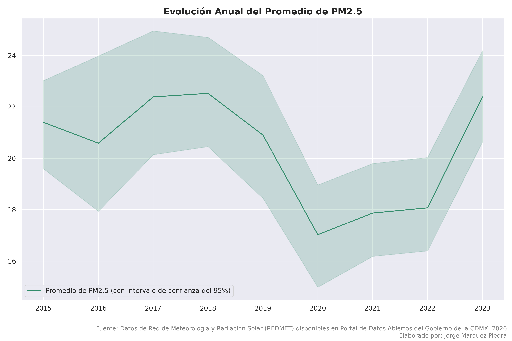**

**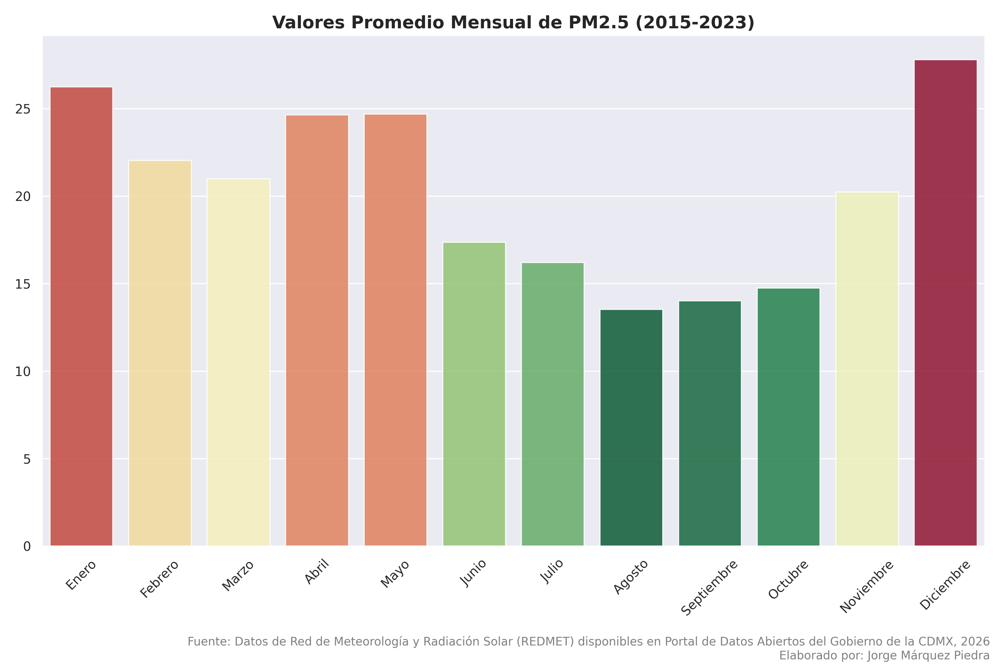**

**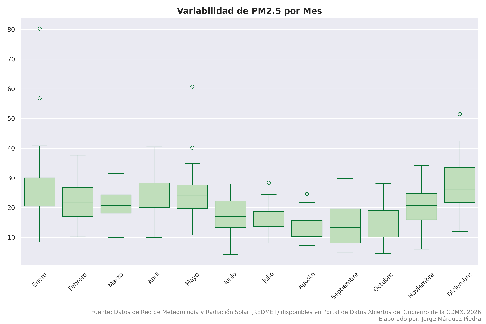**

**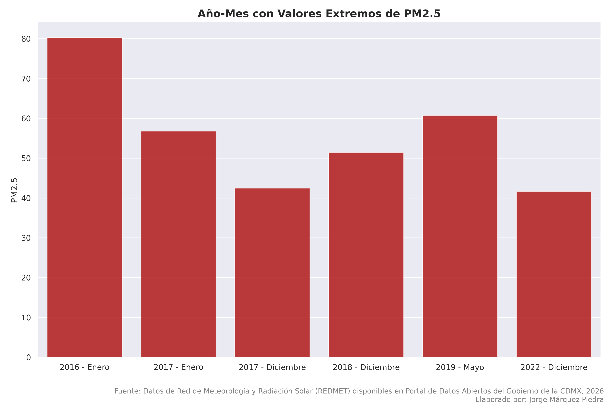**

**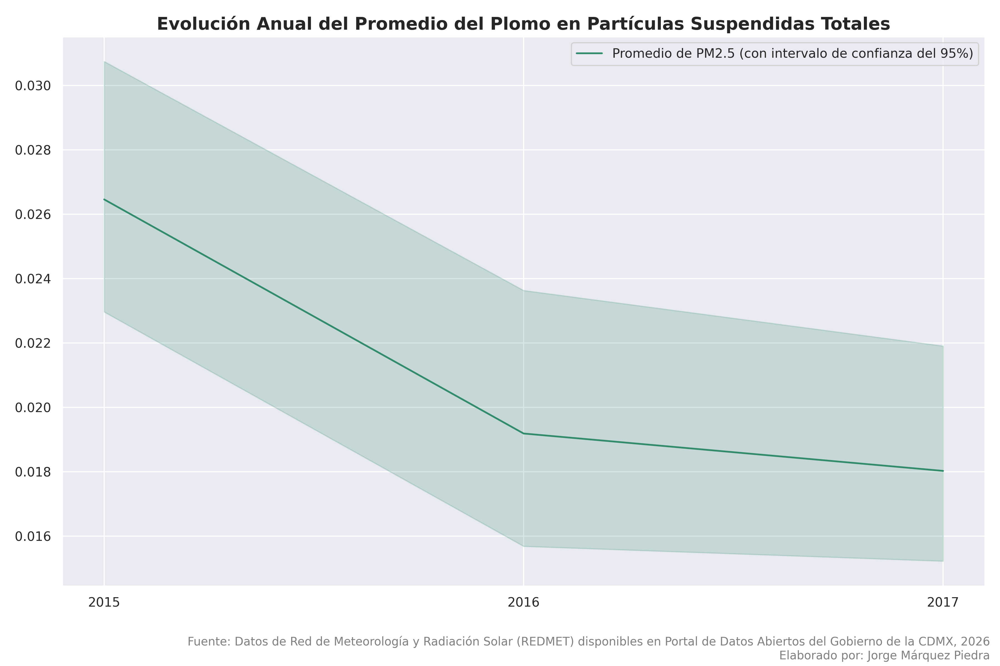**

**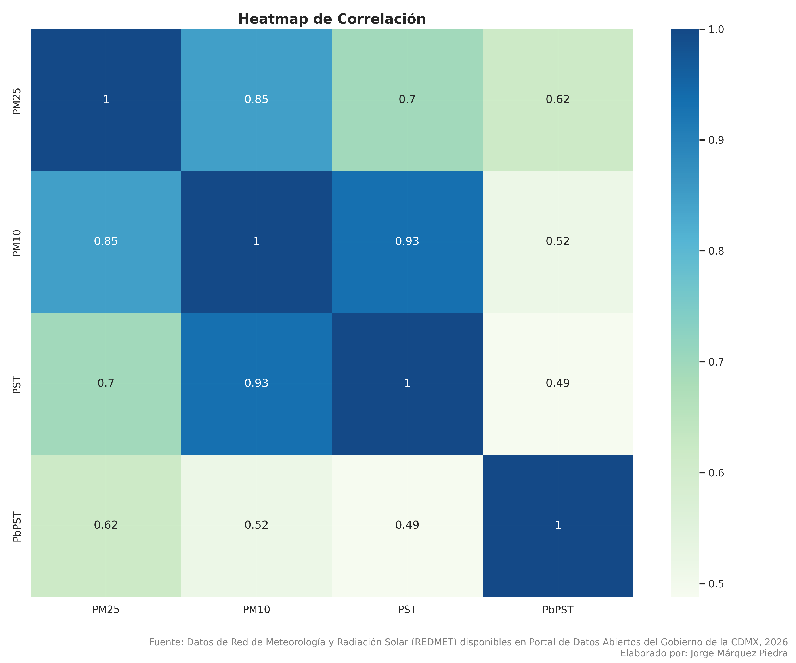**

**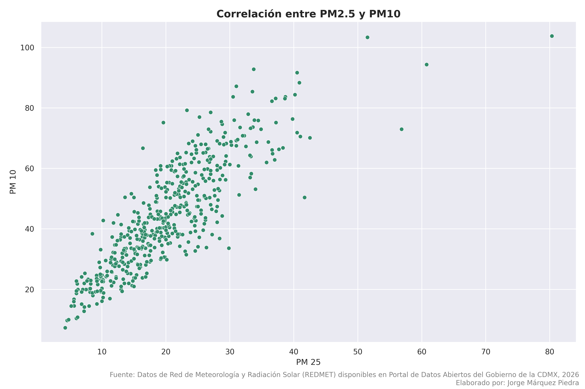**

**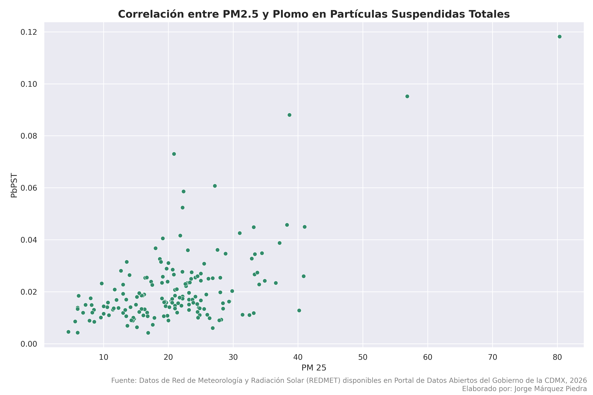**

**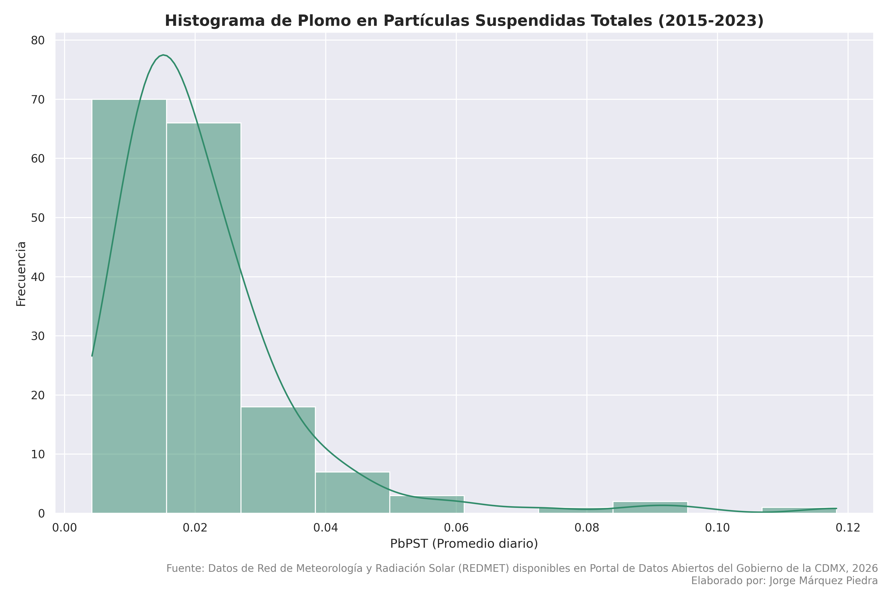**

**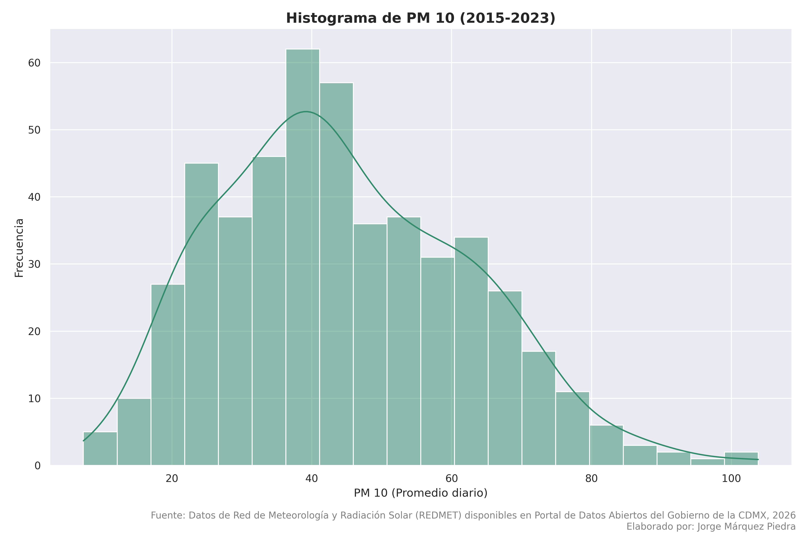**

**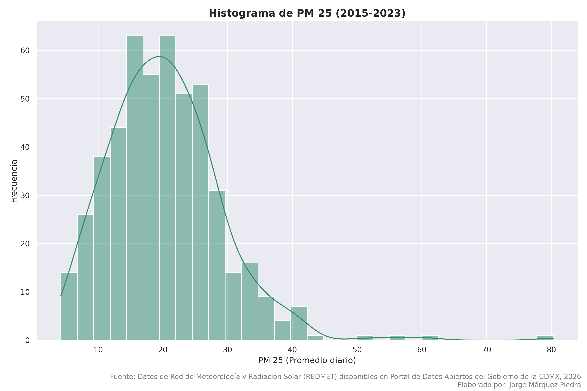**

**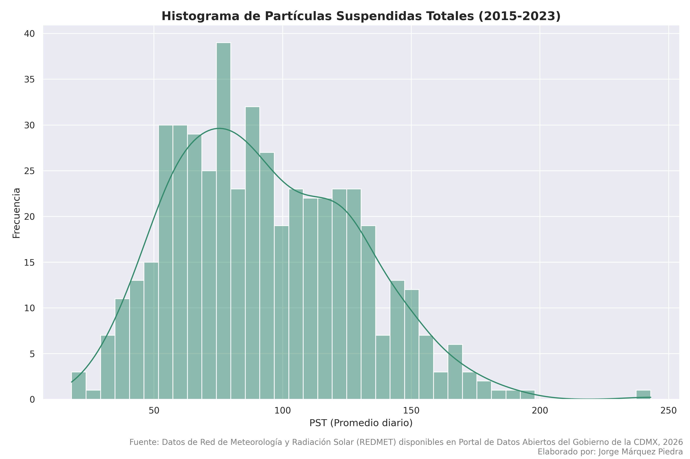**

## Los datos fueron obtenidos del [Portal de Datos Abiertos de la Ciudad de México](https://datos.cdmx.gob.mx/).
